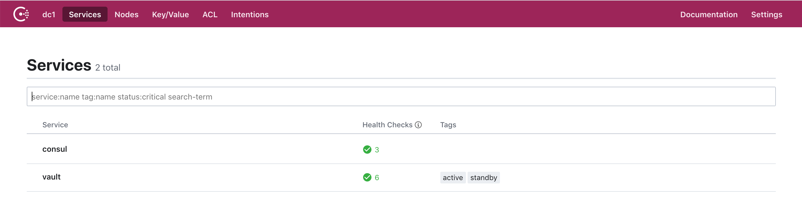
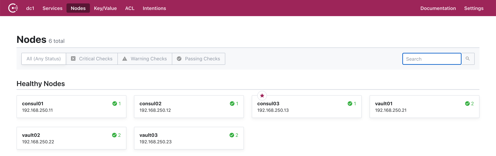
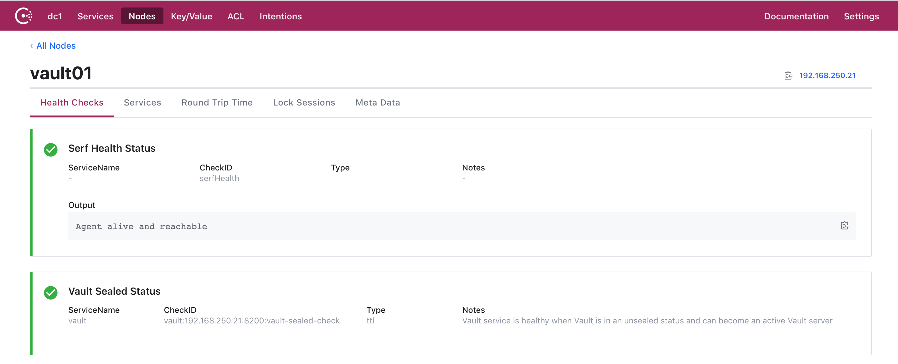
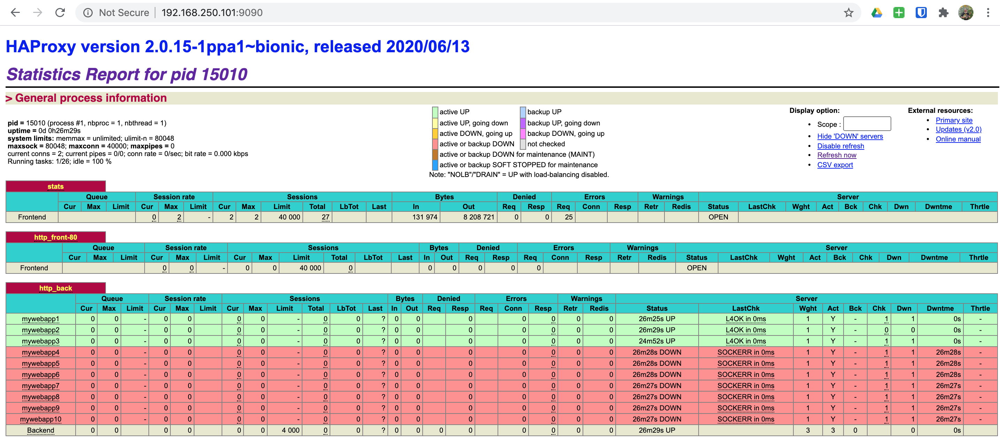

# Hashi Learning

A fun repository for learning all things HashiCorp.

## Getting Started

### Clone Repo

First let's go ahead and clone this repo. Because we use Git submodules, ensure
that you clone exactly like below:

```bash
git clone https://github.com/mrlesmithjr/hashi-learning.git --recursive
```

### Pre-Reqs

> NOTE: Windows support may be limited, but we are open to PR's, etc.

- [Python3](#python3)
- [Terraform](https://www.terraform.io/downloads.html)
- [Vagrant](https://www.vagrantup.com/downloads)
- [VirtualBox](https://www.virtualbox.org/wiki/Downloads)

#### Python3

> NOTE: Ensure that you have a working Python3 setup as we will be using a Python
> virtualenv as part of this repo.

Now let's setup our Python virtualenv. We will be using a virtualenv to ensure
not to clutter up your existing Python environment.

```bash
pip3 install virtualenv
python3 -m venv venv
source venv/bin/activate
pip3 install --upgrade pip pip-tools
pip-sync requirements.txt requirements-dev.txt
```

## Background

Some of us like to get things up and running extremely quick and not have to
worry about the mundane tasks involved. This repo will do exactly that. By
leveraging Vagrant and Ansible to do all of the heavy lifting.

The functionality of this repo will grow over time iteratively. So, keep an eye
out for new functionality over time.

### Current Functionality

The following list is to outline the current functionality available.

- [Three node Consul cluster](#consul-cluster)
- [Three node Vault HA setup leveraging Consul](#vault-ha)
- [Single HAProxy node for Consul service discovery](#haproxy-service-discovery)
- [Three app servers integrated with HAProxy's Consul service discovery](#app-servers)

#### Consul Cluster

There are currently three nodes setup as a fully functional Consul cluster.

- consul01: `192.168.250.11`
- consul02: `192.168.250.12`
- consul03: `192.168.250.13`

#### Vault HA

There are currently three nodes setup as a fully functional Vault HA using Consul
as the storage.

- vault01: `192.168.250.21`
- vault02: `192.168.250.22`
- vault03: `192.168.250.23`

## Spinning Up

Now that all of the [getting started](#getting-started) tasks have been
followed, let's go ahead and spin up!

```bash
vagrant up
...
Bringing machine 'consul01' up with 'virtualbox' provider...
Bringing machine 'consul02' up with 'virtualbox' provider...
Bringing machine 'consul03' up with 'virtualbox' provider...
Bringing machine 'vault01' up with 'virtualbox' provider...
Bringing machine 'vault02' up with 'virtualbox' provider...
Bringing machine 'vault03' up with 'virtualbox' provider...
```

And once everything spins up you are ready to get your learning on.

```bash
PLAY RECAP *********************************************************************
consul01                   : ok=29   changed=12   unreachable=0    failed=0    skipped=30   rescued=0    ignored=0
consul02                   : ok=29   changed=12   unreachable=0    failed=0    skipped=29   rescued=0    ignored=0
consul03                   : ok=29   changed=12   unreachable=0    failed=0    skipped=29   rescued=0    ignored=0
vault01                    : ok=60   changed=22   unreachable=0    failed=0    skipped=20   rescued=0    ignored=0
vault02                    : ok=57   changed=21   unreachable=0    failed=0    skipped=23   rescued=0    ignored=0
vault03                    : ok=57   changed=21   unreachable=0    failed=0    skipped=23   rescued=0    ignored=0
```

### Consul Validation

Now that everything is spun up, open your browser of choice and let's do some quick Consul validations.

- [Consul Services](http://192.168.250.11:8500/ui/dc1/services)

  

- [Consul Node Status](http://192.168.250.11:8500/ui/dc1/nodes)

  

- [Consul Node Health Check](http://192.168.250.11:8500/ui/dc1/nodes/vault01)

  

Let's now SSH into any one of our Consul servers using `vagrant ssh consul[01-03]`.

```bash
vagrant ssh consul01
...
Welcome to Ubuntu 18.04.4 LTS (GNU/Linux 4.15.0-76-generic x86_64)

 * Documentation:  https://help.ubuntu.com
 * Management:     https://landscape.canonical.com
 * Support:        https://ubuntu.com/advantage

Last login: Fri Jul 17 22:07:35 2020 from 192.168.250.1
vagrant@consul01:~$
```

Now that we've logged in, let's change into the `/etc/consul.d` directory.

```bash
cd /etc/consul.d
ls -la
...
vagrant@consul01:/etc/consul.d$ ls -la
total 20
drwxr-xr-x  4 root root 4096 Jul 17 14:43 .
drwxr-xr-x 79 root root 4096 Jul 17 14:43 ..
drwxr-xr-x  2 root root 4096 Jul 17 14:43 client
-rw-r--r--  1 root root  898 Jul 17 14:43 config.json
drwxr-xr-x  2 root root 4096 Jul 17 14:43 scripts
vagrant@consul01:/etc/consul.d$
```

Let's check our Consul cluster status from the CLI while we're here as well.

```bash
consul members list
...
vagrant@consul01:/etc/consul.d$ consul members list
Node      Address              Status  Type    Build  Protocol  DC   Segment
consul01  192.168.250.11:8301  alive   server  1.7.2  2         dc1  <all>
consul02  192.168.250.12:8301  alive   server  1.7.2  2         dc1  <all>
consul03  192.168.250.13:8301  alive   server  1.7.2  2         dc1  <all>
vault01   192.168.250.21:8301  alive   client  1.7.2  2         dc1  <default>
vault02   192.168.250.22:8301  alive   client  1.7.2  2         dc1  <default>
vault03   192.168.250.23:8301  alive   client  1.7.2  2         dc1  <default>
vagrant@consul01:/etc/consul.d$
```

Next let's take a look at `consul01` information specifically.

```bash
consul info
...
vagrant@consul01:/etc/consul.d$ consul info
agent:
	check_monitors = 0
	check_ttls = 0
	checks = 0
	services = 0
build:
	prerelease =
	revision = 9ea1a204
	version = 1.7.2
consul:
	acl = disabled
	bootstrap = false
	known_datacenters = 1
	leader = false
	leader_addr = 192.168.250.13:8300
	server = true
raft:
	applied_index = 5971
	commit_index = 5971
	fsm_pending = 0
	last_contact = 40.955593ms
	last_log_index = 5971
	last_log_term = 3
	last_snapshot_index = 0
	last_snapshot_term = 0
	latest_configuration = [{Suffrage:Voter ID:7eae1134-8516-be4a-6956-a5e5479d73e6 Address:192.168.250.11:8300} {Suffrage:Voter ID:050ccc6a-b71f-0e7d-545c-82ee41de1f81 Address:192.168.250.12:8300} {Suffrage:Voter ID:4d6f59b3-10c4-ade4-245f-2fb1c1f06978 Address:192.168.250.13:8300}]
	latest_configuration_index = 0
	num_peers = 2
	protocol_version = 3
	protocol_version_max = 3
	protocol_version_min = 0
	snapshot_version_max = 1
	snapshot_version_min = 0
	state = Follower
	term = 3
runtime:
	arch = amd64
	cpu_count = 1
	goroutines = 107
	max_procs = 2
	os = linux
	version = go1.13.7
serf_lan:
	coordinate_resets = 0
	encrypted = true
	event_queue = 0
	event_time = 3
	failed = 0
	health_score = 0
	intent_queue = 0
	left = 0
	member_time = 14
	members = 9
	query_queue = 0
	query_time = 1
serf_wan:
	coordinate_resets = 0
	encrypted = true
	event_queue = 0
	event_time = 1
	failed = 0
	health_score = 0
	intent_queue = 0
	left = 0
	member_time = 5
	members = 3
	query_queue = 0
	query_time = 1
vagrant@consul01:/etc/consul.d$
```

And finally, let's take a quick look at our Consul server configuration:

```bash
cat config.json
...
vagrant@consul01:/etc/consul.d$ cat config.json
{
    "acl": {
        "default_policy": "allow",
        "down_policy": "extend-cache",
        "tokens": {
            "agent": "",
            "agent_master": "",
            "default": "",
            "master": "6DA12E0F-D8A5-48C5-AEFF-00D50E84D01A",
            "replication": ""
        }
    },
    "bind_addr": "192.168.250.11",
    "bootstrap_expect": 3,
    "client_addr": "0.0.0.0",
    "data_dir": "/var/consul",
    "datacenter": "dc1",
    "dns_config": {},
    "enable_acl_replication": false,
    "enable_syslog": true,
    "encrypt": "WWw4l0h1LbB4+pC5+VUWiV8kMBNQc+nEwt8OODMx2xg=",
    "log_level": "DEBUG",
    "node_name": "consul01",
    "performance": {},
    "primary_datacenter": "dc1",
    "retry_join": [
        "192.168.250.11",
        "192.168.250.12",
        "192.168.250.13"
    ],
    "retry_join_wan": [],
    "server": true,
    "telemetry": {},
    "ui": true
}
vagrant@consul01:/etc/consul.d$
```

### Vault Validation

Now that we've validated our Consul cluster, let's now take a look
at Vault.

> NOTE: Vault is in an unsealed state at the time of spinning up.

As part of the provisioning, our Vault keys are stored on each of the
Vault servers (Not the safest, but...). So, let's see how we can get access
to these.

Let's SSH into any one of our Vault servers using `vagrant ssh vault[01-03]`.

```bash
vagrant ssh vault01
...
Welcome to Ubuntu 18.04.4 LTS (GNU/Linux 4.15.0-76-generic x86_64)

 * Documentation:  https://help.ubuntu.com
 * Management:     https://landscape.canonical.com
 * Support:        https://ubuntu.com/advantage

Last login: Fri Jul 17 15:42:58 2020 from 192.168.250.1
vagrant@vault01:~$
```

Now we will change into the `/etc/vault.d` directory and take a look.

```bash
cd /etc/vault.d
ls -la
...
vagrant@vault01:/etc/vault.d$ ls -la
total 16
drwxr-xr-x  2 root root  4096 Jul 17 14:44 .
drwxr-xr-x 80 root root  4096 Jul 17 14:43 ..
-r--------  1 root root   768 Jul 17 14:44 .hashi_vault_init.json
-rw-r--r--  1 root vault  493 Jul 17 14:44 vault-config.json
vagrant@vault01:/etc/vault.d$
```

And if you notice there is a hidden file `.hashi_vault_init.json` with only
read permissions for the `root` user. So, in order to view the keys we will need
to use `sudo`.

```bash
sudo cat .hashi_vault_init.json
...
vagrant@vault01:/etc/vault.d$ sudo cat .hashi_vault_init.json
{
    "keys": [
        "b1533be3b65c1e05858c550fcd2e722f828503ccdd4541ced7c14ee2aa404f7811",
        "78c46bf18d4ddc5d8d5c00954efcf327e42e2fe710962db8cb33fd2c2ad4b52dfb",
        "1d0acc10e611f6f6cd28fc4acc71c9f69495e29000749530bebd01bdcac426d82c",
        "30825bcbfbf1781229adfff74ec94d07bb1c39e7eea052dd62bd66edb70670fb0d",
        "4b620d270f19cf491b62841527f083debecfdbf2e7979a203d60c2aefeda191580"
    ],
    "keys_base64": [
        "sVM747ZcHgWFjFUPzS5yL4KFA8zdRUHO18FO4qpAT3gR",
        "eMRr8Y1N3F2NXACVTvzzJ+QuL+cQli24yzP9LCrUtS37",
        "HQrMEOYR9vbNKPxKzHHJ9pSV4pAAdJUwvr0BvcrEJtgs",
        "MIJby/vxeBIprf/3TslNB7scOefuoFLdYr1m7bcGcPsN",
        "S2INJw8Zz0kbYoQVJ/CD3r7P2/Lnl5ogPWDCrv7aGRWA"
    ],
    "root_token": "s.DQ84tbYvsaiG8sipOiK6OmLv"
}
vagrant@vault01:/etc/vault.d$
```

Now let's check our Vault status from the CLI while we're here.

First we will need to set an environment variable to define our `VAULT_ADDR`. This is required because we are not using TLS, which
is the default for the `vault` command.

```bash
export VAULT_ADDR="http://127.0.0.1:8200"
```

Now we can check our Vault status properly from the CLI.

```bash
vault status
...
vagrant@vault01:/etc/vault.d$ vault status
Key             Value
---             -----
Seal Type       shamir
Initialized     true
Sealed          false
Total Shares    5
Threshold       3
Version         1.4.1
Cluster Name    vault-cluster-57e7a21f
Cluster ID      2691685a-390d-50d9-48b4-e9efc459016a
HA Enabled      true
HA Cluster      https://192.168.250.21:8201
HA Mode         active
vagrant@vault01:/etc/vault.d$
```

While we are here, let's also take a quick look at our Vault configuration.

```bash
cat vault-config.json
...
vagrant@vault01:/etc/vault.d$ cat vault-config.json
{
    "api_addr": "http://192.168.250.21:8200",
    "cluster_addr": "http://192.168.250.21:8201",
    "listener": [
        {
            "tcp": {
                "address": "192.168.250.21:8200",
                "cluster_address": "192.168.250.21:8201",
                "tls_disable": true
            }
        },
        {
            "tcp": {
                "address": "127.0.0.1:8200",
                "tls_disable": true
            }
        }
    ],
    "storage": {
        "consul": {
            "address": "127.0.0.1:8500",
            "path": "vault/",
            "scheme": "http"
        }
    },
    "ui": true
}
vagrant@vault01:/etc/vault.d$
```

And if you notice in the `storage` portion, we are using the adress of `127.0.0.1`.

```bash
    "storage": {
        "consul": {
            "address": "127.0.0.1:8500",
            "path": "vault/",
            "scheme": "http"
        }
    },
```

The reason for this is that we are using a Consul client installation on the
Vault servers to properly join our Consul cluster.

If you take a look at the Consul configuration you'll see how that is done. So,
let's change into the `/etc/consul.d` directory.

```bash
cd /etc/consul.d
ls -la
...
vagrant@vault01:/etc/consul.d$ ls -la
total 16
drwxr-xr-x  4 root root 4096 Jul 17 14:43 .
drwxr-xr-x 80 root root 4096 Jul 17 14:43 ..
drwxr-xr-x  2 root root 4096 Jul 17 14:43 client
drwxr-xr-x  2 root root 4096 Jul 17 14:43 scripts
vagrant@vault01:/etc/consul.d$
```

Because we are using Consul as a client rather than a server, let's change into
the `client` directory.

```bash
cd client
ls -la
...
vagrant@vault01:/etc/consul.d/client$ ls -la
total 12
drwxr-xr-x 2 root root 4096 Jul 17 14:43 .
drwxr-xr-x 4 root root 4096 Jul 17 14:43 ..
-rw-r--r-- 1 root root  414 Jul 17 14:43 config.json
vagrant@vault01:/etc/consul.d/client$
```

In this directory you will find the `config.json` file. So, let's take a look
at that.

```bash
cat config.json
...
vagrant@vault01:/etc/consul.d/client$ cat config.json
{
    "bind_addr": "192.168.250.21",
    "client_addr": "0.0.0.0",
    "data_dir": "/var/consul/data",
    "datacenter": "dc1",
    "enable_syslog": true,
    "encrypt": "WWw4l0h1LbB4+pC5+VUWiV8kMBNQc+nEwt8OODMx2xg=",
    "log_level": "DEBUG",
    "node_name": "vault01",
    "retry_join": [
        "192.168.250.11",
        "192.168.250.12",
        "192.168.250.13"
    ],
    "server": false,
    "ui": true
}
vagrant@vault01:/etc/consul.d/client$
```

And if you take a look at the `retry_join` portion, you'll notice that we have
our three Consul servers defined.

```bash
    "retry_join": [
        "192.168.250.11",
        "192.168.250.12",
        "192.168.250.13"
    ],
```

## HAProxy Service Discovery

> NOTE: This scenario was borrowed from [https://learn.hashicorp.com/consul/integrations/haproxy-consul](https://learn.hashicorp.com/consul/integrations/haproxy-consul). However, we've automated the whole process.

To see how we integrate HAProxy with Consul for service discovery. We have a
working HAProxy node (`lb01`) up and running.

To get a quick view of the HAProxy admin stats page, head over [here](http://192.168.250.101:9090/) and login with `admin:admin`.



And as you can see, we have some web servers up and running. And fully integrated
with Consul for service discovery.

Let's quickly SSH into our HAProxy server and take a look at the Consul and
HAProxy configurations.

```bash
vagrant ssh lb01
...
Welcome to Ubuntu 18.04.4 LTS (GNU/Linux 4.15.0-76-generic x86_64)

 * Documentation:  https://help.ubuntu.com
 * Management:     https://landscape.canonical.com
 * Support:        https://ubuntu.com/advantage

Last login: Sat Jul 18 02:51:40 2020 from 10.0.2.2
vagrant@lb01:~$
```

Now that we've logged in, let's change to the `/etc/consul.d/client` directory.

```bash
cd /etc/consul.d/client
```

Next let's look at the Consul configuration.

```bash
cat config.json
...
vagrant@lb01:/etc/consul.d/client$ cat config.json
{
    "bind_addr": "192.168.250.101",
    "client_addr": "0.0.0.0",
    "data_dir": "/var/consul/data",
    "datacenter": "dc1",
    "enable_script_checks": true,
    "enable_syslog": true,
    "encrypt": "WWw4l0h1LbB4+pC5+VUWiV8kMBNQc+nEwt8OODMx2xg=",
    "log_level": "DEBUG",
    "node_name": "lb01",
    "retry_join": [
        "192.168.250.11",
        "192.168.250.12",
        "192.168.250.13"
    ],
    "server": false,
    "ui": true
}
vagrant@lb01:/etc/consul.d/client$
```

And from the configuration above, you **SHOULD** notice that this configuration
looks identical to our Vault server configuration.

Next let's change to the `/etc/haproxy` directory and look at our HAProxy
configuration.

```bash
cd /etc/haproxy
cat haproxy.cfg
...
vagrant@lb01:/etc/haproxy$ cat haproxy.cfg
#
# Ansible managed
#

global
    log /dev/log local0
    log /dev/log local1 notice
    daemon
    chroot /var/lib/haproxy
    group haproxy
    maxconn 40000
    spread-checks 3
    stats socket /var/run/haproxy.sock mode 660 level admin
    stats timeout 30s
    user haproxy
    # Default SSL material locations
    ca-base /etc/ssl/certs
    crt-base /etc/ssl/private

    # Default ciphers to use on SSL-enabled listening sockets.
    # For more information, see ciphers(1SSL).
    ssl-default-bind-ciphers kEECDH+aRSA+AES:kRSA+AES:+AES256:RC4-SHA:!kEDH:!LOW:!EXP:!MD5:!aNULL:!eNULL
    ssl-default-bind-options no-sslv3

defaults
    log global
    maxconn 40000
    mode tcp
    option dontlognull
    option redispatch
    option tcp-smart-accept
    option tcp-smart-connect
    option tcplog
    retries 3
    timeout client 50000
    timeout connect 50000
    timeout queue 5000
    timeout server 50000

userlist STATSUSERS
    group admin users admin
    user admin insecure-password admin

frontend stats
    acl AuthOkay_ReadOnly http_auth(STATSUSERS)
    acl AuthOkay_Admin http_auth_group(STATSUSERS) admin
    bind *:9090
    mode http
    stats enable
    stats http-request auth realm stats unless AuthOkay_ReadOnly
    stats refresh 10s
    stats show-legends
    stats uri /

frontend http_front-80
    bind *:80
    default_backend http_back

backend http_back

    balance roundrobin
    server-template mywebapp 10 _web._tcp.service.consul resolvers consul resolve-opts allow-dup-ip resolve-prefer ipv4 check

resolvers consul
  nameserver consul 127.0.0.1:8600
  accepted_payload_size 8192
  hold valid 5s
vagrant@lb01:/etc/haproxy$
```

Now looking at this configuration, the real magic is happening within the
following two blocks:

```bash
backend http_back

    balance roundrobin
    server-template mywebapp 10 _web._tcp.service.consul resolvers consul resolve-opts allow-dup-ip resolve-prefer ipv4 check
```

The above block is defining the `server-template` which is used to perform the
service discovery within our Consul cluster. The template is telling HAProxy
to discover the `web` services that are registered in Consul using the `consul`
resolver as defined below. To do the DNS discovery for us and return the results
back to HAProxy.

```bash
resolvers consul
  nameserver consul 127.0.0.1:8600
  accepted_payload_size 8192
  hold valid 5s
```

## App Servers

We have also spun up three app servers with our stack. These servers will over
time provide us many different services in which we will use for learning. But
for now, the following list is what they provide:

- NGINX: HTTP

> NOTE: SSH to any one of `app[01-03]`.

These servers are also running the Consul client which is configured as below:

```bash
vagrant ssh app01
cd /etc/consul.d/client
cat config.json
...
vagrant@app01:/etc/consul.d/client$ cat config.json
{
    "bind_addr": "192.168.250.31",
    "client_addr": "0.0.0.0",
    "data_dir": "/var/consul/data",
    "datacenter": "dc1",
    "enable_script_checks": true,
    "enable_syslog": true,
    "encrypt": "WWw4l0h1LbB4+pC5+VUWiV8kMBNQc+nEwt8OODMx2xg=",
    "log_level": "DEBUG",
    "node_name": "app01",
    "retry_join": [
        "192.168.250.11",
        "192.168.250.12",
        "192.168.250.13"
    ],
    "server": false,
    "ui": true
}
vagrant@app01:/etc/consul.d/client$
```

And once again, we **SHOULD** notice that our Consul client configuration is
identical to our HAProxy and Vault servers.

For us to register Consul services on our app servers, we are using Ansible to
do this. You can checkout the important pieces of how this is done by viewing
the following:

- [group_vars/app_servers/consul.yml](.vagrant/provisioners/ansible/inventory/group_vars/app_servers/consul.yml)
- [playbooks/app_servers.yml](playbooks/app_servers.yml)

And to prove that they are working correctly through our HAProxy load balancer,
simply browse to [http://192.168.250.101](http://192.168.250.101).


## Tearing Down

When you are all done learning and are ready to tear everything down,
simply:

```bash
./scripts/cleanup.sh
```

## License

MIT

## Author Information

Larry Smith Jr.

- [@mrlesmithjr](https://twitter.com/mrlesmithjr)
- [mrlesmithjr@gmail.com](mailto:mrlesmithjr@gmail.com)
- [http://everythingshouldbevirtual.com](http://everythingshouldbevirtual.com)
