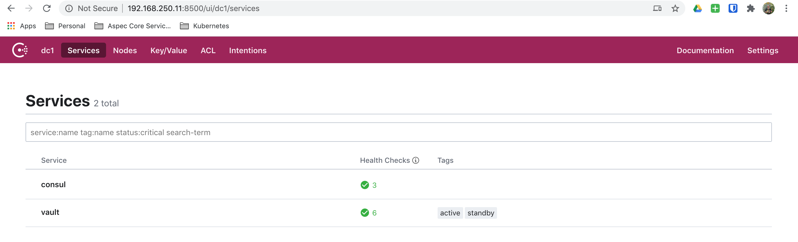
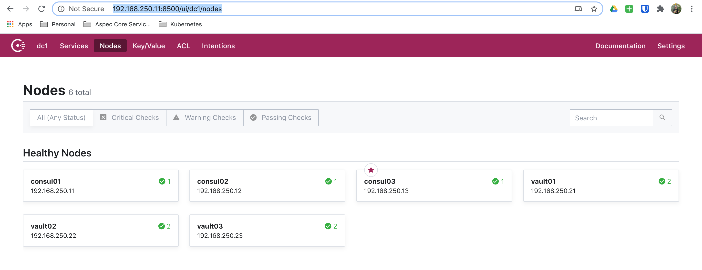
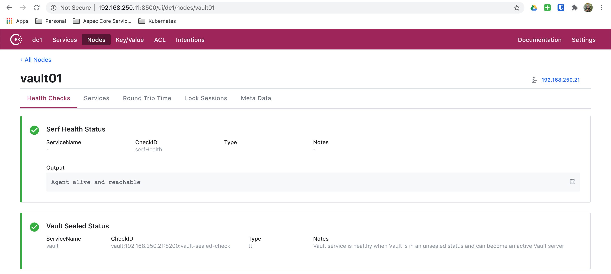

# Hashi Learning

A fun repository for learning all things HashiCorp.

## Getting Started

### Clone Repo

First let's go ahead and clone this repo. Because we use Git submodules, ensure
that you clone exactly like below:

```bash
git clone https://github.com/mrlesmithjr/hashi-learning.git --recursive
```

### Pre-Reqs

> NOTE: Windows support may be limited, but we are open to PR's, etc.

- [Python3](#python3)
- [Terraform](https://www.terraform.io/downloads.html)
- [Vagrant](https://www.vagrantup.com/downloads)
- [VirtualBox](https://www.virtualbox.org/wiki/Downloads)

#### Python3

> NOTE: Ensure that you have a working Python3 setup as we will be using a Python
> virtualenv as part of this repo.

Now let's setup our Python virtualenv. We will be using a virtualenv to ensure
not to clutter up your existing Python environment.

```bash
pip3 install virtualenv
python3 -m venv venv
source venv/bin/activate
pip3 install --upgrade pip pip-tools
pip-sync requirements.txt requirements-dev.txt
```

## Background

Some of us like to get things up and running extremely quick and not have to
worry about the mundane tasks involved. This repo will do exactly that. By
leveraging Vagrant and Ansible to do all of the heavy lifting.

The functionality of this repo will grow over time iteratively. So, keep an eye
out for new functionality over time.

### Current Functionality

The following list is to outline the current functionality available.

- [Three node Consul cluster](#consul-cluster)
- [Three node Vault HA setup leveraging Consul](#vault-ha)

#### Consul Cluster

There are currently three nodes setup as a fully functional Consul cluster.

- consul01: `192.168.250.11`
- consul02: `192.168.250.12`
- consul03: `192.168.250.13`

#### Vault HA

There are currently three nodes setup as a fully functional Vault HA using Consul
as the storage.

- vault01: `192.168.250.21`
- vault02: `192.168.250.22`
- vault03: `192.168.250.23`

## Spinning Up

Now that all of the [getting started](#getting-started) tasks have been
followed, let's go ahead and spin up!

```bash
vagrant up
...
Bringing machine 'consul01' up with 'virtualbox' provider...
Bringing machine 'consul02' up with 'virtualbox' provider...
Bringing machine 'consul03' up with 'virtualbox' provider...
Bringing machine 'vault01' up with 'virtualbox' provider...
Bringing machine 'vault02' up with 'virtualbox' provider...
Bringing machine 'vault03' up with 'virtualbox' provider...
```

And once everything spins up you are ready to get your learning on.

```bash
PLAY RECAP *********************************************************************
consul01                   : ok=29   changed=12   unreachable=0    failed=0    skipped=30   rescued=0    ignored=0
consul02                   : ok=29   changed=12   unreachable=0    failed=0    skipped=29   rescued=0    ignored=0
consul03                   : ok=29   changed=12   unreachable=0    failed=0    skipped=29   rescued=0    ignored=0
vault01                    : ok=60   changed=22   unreachable=0    failed=0    skipped=20   rescued=0    ignored=0
vault02                    : ok=57   changed=21   unreachable=0    failed=0    skipped=23   rescued=0    ignored=0
vault03                    : ok=57   changed=21   unreachable=0    failed=0    skipped=23   rescued=0    ignored=0
```

### Consul Validation

Now that everything is spun up, open your browser of choice and let's do some quick Consul validations.

- [Consul Services](http://192.168.250.11:8500/ui/dc1/services)

  

- [Consul Node Status](http://192.168.250.11:8500/ui/dc1/nodes)

  

- [Consul Node Health Check](http://192.168.250.11:8500/ui/dc1/nodes/vault01)

  

## Tearing Down

When you are all done learning and are ready to tear everything down,
simply:

```bash
./scripts/cleanup.sh
```

## License

MIT

## Author Information

Larry Smith Jr.

- [@mrlesmithjr](https://twitter.com/mrlesmithjr)
- [mrlesmithjr@gmail.com](mailto:mrlesmithjr@gmail.com)
- [http://everythingshouldbevirtual.com](http://everythingshouldbevirtual.com)
