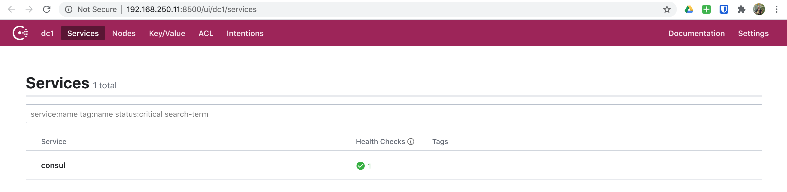
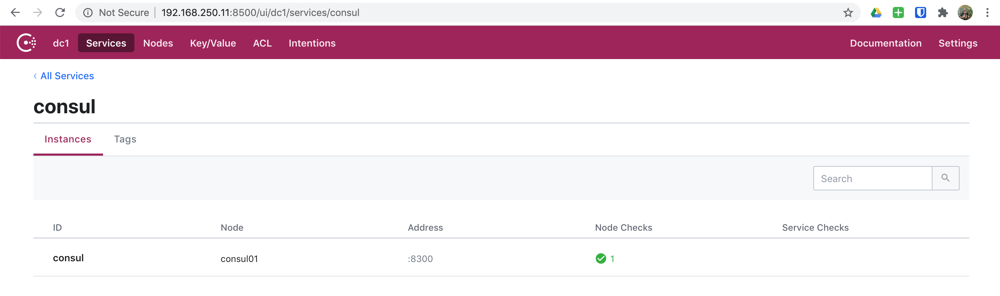
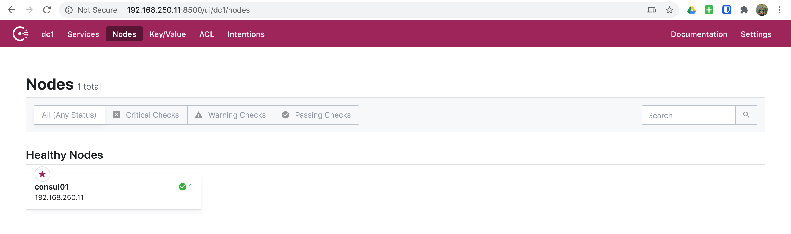
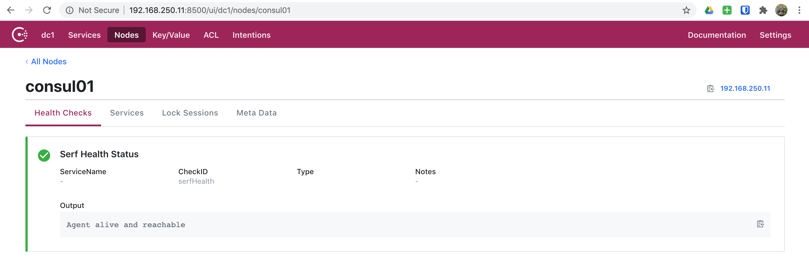

# 05. Consul - Single Node

In this scenario, we will simply spin up a single node Consul server which will
provide us a learning environment to get familiar with basic Consul concepts.

## Spinning Up

First we need to export our scenario configuration for Vagrant:

```bash
export SCENARIO=scenarios/consul.yml
```

Now that we've exported our scenario configuration, we are ready to spin up
our environment:

```bash
vagrant up
```

And off we go! You will see a lot going on here as Vagrant and Ansible do their
job.

```bash
▶ vagrant up
Bringing machine 'consul01' up with 'virtualbox' provider...
...
PLAY RECAP *********************************************************************
consul01                   : ok=30   changed=13   unreachable=0    failed=0    skipped=22   rescued=0    ignored=0
```

And once all of the provisioning finishes, we will have a single node Consul
server ready for us to explore.

### Nodes

This scenario has the following nodes when completed.

|   Node   |     IP #1      | IP #2 |
| :------: | :------------: | :---: |
| consul01 | 192.168.250.11 |       |

## CLI

Now we are ready to begin exploring our Consul server using the CLI. So, to do
this. Let's SSH into our `consul01` node.

```bash
vagrant ssh consul01
```

```bash
▶ vagrant ssh consul01
Welcome to Ubuntu 18.04.4 LTS (GNU/Linux 4.15.0-76-generic x86_64)

 * Documentation:  https://help.ubuntu.com
 * Management:     https://landscape.canonical.com
 * Support:        https://ubuntu.com/advantage

Last login: Mon Jul 20 14:45:45 2020 from 10.0.2.2
vagrant@consul01:~$
```

Now that we've logged in, let's change into the `/etc/consul.d` directory and
see what files/directories are present.

```bash
cd /etc/consul.d
ls -la
```

```bash
vagrant@consul01:~$ cd /etc/consul.d
vagrant@consul01:/etc/consul.d$ ls -la
total 20
drwxr-xr-x  4 root root 4096 Jul 20 14:36 .
drwxr-xr-x 79 root root 4096 Jul 20 14:36 ..
drwxr-xr-x  2 root root 4096 Jul 20 14:36 client
-rw-r--r--  1 root root  846 Jul 20 14:36 config.json
drwxr-xr-x  2 root root 4096 Jul 20 14:36 scripts
vagrant@consul01:/etc/consul.d$
```

### CLI - Configuration

Let's first take a quick look at our Consul configuration while we're here.

```bash
cat config.json
```

```bash
vagrant@consul01:/etc/consul.d$ cat config.json
{
    "acl": {
        "default_policy": "allow",
        "down_policy": "extend-cache",
        "tokens": {
            "agent": "",
            "agent_master": "",
            "default": "",
            "master": "6DA12E0F-D8A5-48C5-AEFF-00D50E84D01A",
            "replication": ""
        }
    },
    "bind_addr": "192.168.250.11",
    "bootstrap_expect": 1,
    "client_addr": "0.0.0.0",
    "data_dir": "/var/consul",
    "datacenter": "dc1",
    "dns_config": {},
    "enable_acl_replication": false,
    "enable_syslog": true,
    "encrypt": "WWw4l0h1LbB4+pC5+VUWiV8kMBNQc+nEwt8OODMx2xg=",
    "log_level": "DEBUG",
    "node_name": "consul01",
    "performance": {},
    "primary_datacenter": "dc1",
    "retry_join": [
        "192.168.250.11"
    ],
    "retry_join_wan": [],
    "server": true,
    "telemetry": {},
    "ui": true
}
vagrant@consul01:/etc/consul.d$
```

And if we wanted to do a quick validation of our Consul configuration, we can
do so by:

```bash
consul validate /etc/consul.d
```

```bash
vagrant@consul01:/etc/consul.d$ consul validate /etc/consul.d
Configuration is valid!
vagrant@consul01:/etc/consul.d$
```

### CLI - Datacenters

Next, let's see what Consul datacenters exist:

```bash
consul catalog datacenters
```

```bash
vagrant@consul01:/etc/consul.d$ consul catalog datacenters
dc1
vagrant@consul01:/etc/consul.d$
```

We can also use `curl` to retrieve the same information:

```bash
curl --silent http://127.0.0.1:8500/v1/catalog/datacenters | jq
```

```bash
vagrant@consul01:/etc/consul.d$ curl --silent http://127.0.0.1:8500/v1/catalog/datacenters | jq
[
  "dc1"
]
vagrant@consul01:/etc/consul.d$
```

### CLI - Services

Next, let's check and see what services are available:

```bash
consul catalog services
```

```bash
vagrant@consul01:/etc/consul.d$ consul catalog services
consul
vagrant@consul01:/etc/consul.d$
```

We can also use `curl` to retrieve the same information:

```bash
curl --silent http://127.0.0.1:8500/v1/catalog/services | jq
```

```bash
vagrant@consul01:/etc/consul.d$ curl --silent http://127.0.0.1:8500/v1/catalog/services | jq
{
  "consul": []
}
vagrant@consul01:/etc/consul.d$
```

### CLI - Nodes

Next, let's get a list of nodes available:

```bash
consul catalog nodes
```

```bash
vagrant@consul01:/etc/consul.d$ consul catalog nodes
Node      ID        Address         DC
consul01  290c5be7  192.168.250.11  dc1
vagrant@consul01:/etc/consul.d$
```

The command above gives us a simplistic view of our nodes, but if we'd like to
get a more detailed view we can execute the following:

```bash
consul catalog nodes --detailed
```

```bash
vagrant@consul01:/etc/consul.d$ consul catalog nodes --detailed
Node      ID                                    Address         DC   TaggedAddresses                                                                           Meta
consul01  290c5be7-7a03-7e9a-5db4-d87f912c1674  192.168.250.11  dc1  lan=192.168.250.11, lan_ipv4=192.168.250.11, wan=192.168.250.11, wan_ipv4=192.168.250.11  consul-network-segment=
vagrant@consul01:/etc/consul.d$
```

As you can see, the above command gives us a much better detailed view into
our nodes.

We can also use `curl` to get the same information:

```bash
curl --silent http://127.0.0.1:8500/v1/catalog/nodes | jq
```

```bash
vagrant@consul01:/etc/consul.d$ curl --silent http://127.0.0.1:8500/v1/catalog/nodes | jq
[
  {
    "ID": "290c5be7-7a03-7e9a-5db4-d87f912c1674",
    "Node": "consul01",
    "Address": "192.168.250.11",
    "Datacenter": "dc1",
    "TaggedAddresses": {
      "lan": "192.168.250.11",
      "lan_ipv4": "192.168.250.11",
      "wan": "192.168.250.11",
      "wan_ipv4": "192.168.250.11"
    },
    "Meta": {
      "consul-network-segment": ""
    },
    "CreateIndex": 5,
    "ModifyIndex": 6
  }
]
vagrant@consul01:/etc/consul.d$
```

And if we'd like to get detailed information for node `consul01` using `curl`:

```bash
curl --silent http://127.0.0.1:8500/v1/catalog/node/consul01 | jq
```

```bash
vagrant@consul01:/etc/consul.d$ curl --silent http://127.0.0.1:8500/v1/catalog/node/consul01 | jq
{
  "Node": {
    "ID": "290c5be7-7a03-7e9a-5db4-d87f912c1674",
    "Node": "consul01",
    "Address": "192.168.250.11",
    "Datacenter": "dc1",
    "TaggedAddresses": {
      "lan": "192.168.250.11",
      "lan_ipv4": "192.168.250.11",
      "wan": "192.168.250.11",
      "wan_ipv4": "192.168.250.11"
    },
    "Meta": {
      "consul-network-segment": ""
    },
    "CreateIndex": 5,
    "ModifyIndex": 6
  },
  "Services": {
    "consul": {
      "ID": "consul",
      "Service": "consul",
      "Tags": [],
      "Address": "",
      "Meta": {
        "raft_version": "3",
        "serf_protocol_current": "2",
        "serf_protocol_max": "5",
        "serf_protocol_min": "1",
        "version": "1.7.2"
      },
      "Port": 8300,
      "Weights": {
        "Passing": 1,
        "Warning": 1
      },
      "EnableTagOverride": false,
      "Proxy": {
        "MeshGateway": {},
        "Expose": {}
      },
      "Connect": {},
      "CreateIndex": 5,
      "ModifyIndex": 5
    }
  }
}
vagrant@consul01:/etc/consul.d$
```

We can also get the health of our `consul01` node using `curl`:

```bash
curl --silent http://127.0.0.1:8500/v1/health/node/consul01 | jq
```

```bash
vagrant@consul01:/etc/consul.d$ curl --silent http://127.0.0.1:8500/v1/health/node/consul01 | jq
[
  {
    "Node": "consul01",
    "CheckID": "serfHealth",
    "Name": "Serf Health Status",
    "Status": "passing",
    "Notes": "",
    "Output": "Agent alive and reachable",
    "ServiceID": "",
    "ServiceName": "",
    "ServiceTags": [],
    "Type": "",
    "Definition": {},
    "CreateIndex": 5,
    "ModifyIndex": 5
  }
]
vagrant@consul01:/etc/consul.d$
```

### CLI - Datacenter Members

To get a list of Consul datacenter members, we can simply execute:

```bash
consul members list
```

```bash
vagrant@consul01:/etc/consul.d$ consul members list
Node      Address              Status  Type    Build  Protocol  DC   Segment
consul01  192.168.250.11:8301  alive   server  1.7.2  2         dc1  <all>
vagrant@consul01:/etc/consul.d$
```

Next let's take a look at `consul01` information specifically.

```bash
consul info
```

```bash
vagrant@consul01:/etc/consul.d$ consul info
agent:
	check_monitors = 0
	check_ttls = 0
	checks = 0
	services = 0
build:
	prerelease =
	revision = 9ea1a204
	version = 1.7.2
consul:
	acl = disabled
	bootstrap = true
	known_datacenters = 1
	leader = true
	leader_addr = 192.168.250.11:8300
	server = true
raft:
	applied_index = 142
	commit_index = 142
	fsm_pending = 0
	last_contact = 0
	last_log_index = 142
	last_log_term = 3
	last_snapshot_index = 0
	last_snapshot_term = 0
	latest_configuration = [{Suffrage:Voter ID:290c5be7-7a03-7e9a-5db4-d87f912c1674 Address:192.168.250.11:8300}]
	latest_configuration_index = 0
	num_peers = 0
	protocol_version = 3
	protocol_version_max = 3
	protocol_version_min = 0
	snapshot_version_max = 1
	snapshot_version_min = 0
	state = Leader
	term = 3
runtime:
	arch = amd64
	cpu_count = 1
	goroutines = 81
	max_procs = 2
	os = linux
	version = go1.13.7
serf_lan:
	coordinate_resets = 0
	encrypted = true
	event_queue = 1
	event_time = 3
	failed = 0
	health_score = 0
	intent_queue = 1
	left = 0
	member_time = 3
	members = 1
	query_queue = 0
	query_time = 1
serf_wan:
	coordinate_resets = 0
	encrypted = true
	event_queue = 0
	event_time = 1
	failed = 0
	health_score = 0
	intent_queue = 0
	left = 0
	member_time = 1
	members = 1
	query_queue = 0
	query_time = 1
vagrant@consul01:/etc/consul.d$
```

## UI

Now that we've explored our Consul setup using some basic CLI commands, let's
jump into the Consul UI.

Open your preferred browser of choice and head over to [http://192.168.250.11:8500/ui](http://192.168.250.11:8500/ui)

### UI - Services

Click on services and you'll see we only have one service currently in Consul,
which will look like below.



And if you click on the `Consul` service to dig in further, you'll see a bit
of information on our `Consul` service.



### UI - Nodes

Next, let's click on nodes and we **SHOULD** only see our `consul01` node listed.



Let's now click on `consul01` and dig in a bit more on this node.



## DNS

One of the beautiful things with Consul is that we have access to a DNS
interface. The DNS interfaces provides us with a way to perform various lookups
using normal DNS methods. This removes the need to use the API to do a lookup
of any kind. One thing to note here is: The Consul DNS interface listens on
port `8600` by default.

> NOTE: We will explore options to get the DNS interface to become transparent
> to systems in a later excercise.

### DNS - Node Lookups

One example of using the DNS interface is to lookup nodes and get a list of
records available.

Let's see what DNS returns for our `consul01` node.

```bash
dig @127.0.0.1 -p 8600 consul01.node.consul ANY
```

```bash
vagrant@consul01:/etc/consul.d$ dig @127.0.0.1 -p 8600 consul01.node.consul ANY

; <<>> DiG 9.11.3-1ubuntu1.11-Ubuntu <<>> @127.0.0.1 -p 8600 consul01.node.consul ANY
; (1 server found)
;; global options: +cmd
;; Got answer:
;; ->>HEADER<<- opcode: QUERY, status: NOERROR, id: 53553
;; flags: qr aa rd; QUERY: 1, ANSWER: 2, AUTHORITY: 0, ADDITIONAL: 1
;; WARNING: recursion requested but not available

;; OPT PSEUDOSECTION:
; EDNS: version: 0, flags:; udp: 4096
;; QUESTION SECTION:
;consul01.node.consul.		IN	ANY

;; ANSWER SECTION:
consul01.node.consul.	0	IN	A	192.168.250.11
consul01.node.consul.	0	IN	TXT	"consul-network-segment="

;; Query time: 1 msec
;; SERVER: 127.0.0.1#8600(127.0.0.1)
;; WHEN: Mon Jul 20 19:50:35 UTC 2020
;; MSG SIZE  rcvd: 101

vagrant@consul01:/etc/consul.d$
```

### DNS - Service Lookups

We can also use Consul to perform service lookups. The context of a service
lookup looks like: `[tag.]<service>.service[.datacenter].<domain>`. The `tag`
is an optional field that can be used to find a specific tag when services may
be named the same but are used for entirely different things.

For example, we may have multiple `db` services registered. But we could use
tags to delineate between `development` and `production`. So, any application
for `development` could find it's `db` service by using `development.db.service.consul`.

Also, the `datacenter` is optional unless you need to find a service outside of
your Consul agent's default Consul datacenter. So, if you are looking for a
service in the same Consul datacenter, you can skip the `datacenter` portion. Otherwise, you can add the `datacenter` to find a service in another Consul
datacenter.

Seeing as we don't have any services registered at this point, we will just use
the default `consul` service to perform an example DNS service lookup.

```bash
dig @127.0.0.1 -p 8600 consul.service.consul
```

```bash
vagrant@consul01:/etc/consul.d$ dig @127.0.0.1 -p 8600 consul.service.consul

; <<>> DiG 9.11.3-1ubuntu1.11-Ubuntu <<>> @127.0.0.1 -p 8600 consul.service.consul
; (1 server found)
;; global options: +cmd
;; Got answer:
;; ->>HEADER<<- opcode: QUERY, status: NOERROR, id: 5946
;; flags: qr aa rd; QUERY: 1, ANSWER: 1, AUTHORITY: 0, ADDITIONAL: 1
;; WARNING: recursion requested but not available

;; OPT PSEUDOSECTION:
; EDNS: version: 0, flags:; udp: 4096
;; QUESTION SECTION:
;consul.service.consul.		IN	A

;; ANSWER SECTION:
consul.service.consul.	0	IN	A	192.168.250.11

;; Query time: 0 msec
;; SERVER: 127.0.0.1#8600(127.0.0.1)
;; WHEN: Mon Jul 20 20:06:08 UTC 2020
;; MSG SIZE  rcvd: 66

vagrant@consul01:/etc/consul.d$
```

### DNS - systemd-resolved

Oh my! **systemd-resolved** What a pain. However, we can work around this
relatively easy and not disable it. Many times I have opted to just disable
`systemd-resolved` and install `Dnsmasq` and move on. But for this learnining
we will install `Dnsmasq`, reconfigure `systemd-resolved` to forward
to `Dnsmasq`, and configure `Dnsmasq` to forward the `consul` domain to our
Consul client's DNS port.

We will be doing this on all of our servers within our stack to ensure they
are all consistent. As well as, properly resolve services registered in Consul
without the need to do specific work arounds for various things such as: NGINX,
etc. The benefit will be to understand how we can leverge Consul in any
environment. To easily reach our services without load balancers, etc.
For example, we might have an NGINX web server configured as a reverse proxy
for many different sites within our environment. Think of our NGINX reverse
proxy functioning as a form of an application gateway. We could frontend our
application gateways with an external load balancer, which sends all HTTP(s)
traffic to our application gateways. Then our application gateways can make
decisions based on the URL, to properly redirect to our applications. The point
here is that we could easily just define resolvers for NGINX, but that wouldn't
solve OS level DNS resolution for services such as logging, etc.

So, what does this look like after we provision our servers? Let's jump in and
take a look.

```bash
vagrant ssh consul01
```

Next, let's look at our `systemd-resolved` configuration and then Dnsmasq.

```bash
cat /etc/systemd/resolved.conf
```

```bash
vagrant@consul01:~$ cat /etc/systemd/resolved.conf
#  This file is part of systemd.
#
#  systemd is free software; you can redistribute it and/or modify it
#  under the terms of the GNU Lesser General Public License as published by
#  the Free Software Foundation; either version 2.1 of the License, or
#  (at your option) any later version.
#
# Entries in this file show the compile time defaults.
# You can change settings by editing this file.
# Defaults can be restored by simply deleting this file.
#
# See resolved.conf(5) for details

[Resolve]
DNS=127.0.0.2
#FallbackDNS=
#Domains=
#LLMNR=no
#MulticastDNS=no
#DNSSEC=no
#Cache=yes
#DNSStubListener=yes
vagrant@consul01:~$
```

The important thing from above is the line `DNS=127.0.0.2`. This is telling
`systemd-resolved` to forward all lookups to `127.0.0.2` which is what IP
`Dnsmasq` is bound to.

And if we take a quick look at `/etc/dnsmasq.conf` we can verify that is correct
as well.

```bash
cat /etc/dnsmasq.conf
```

```bash
vagrant@consul01:~$ cat /etc/dnsmasq.conf
bind-interfaces
port=53
listen-address=127.0.0.2
server=/consul/127.0.0.1#8600

# Uncomment and modify as appropriate to enable reverse DNS lookups for
# common netblocks found in RFC 1918, 5735, and 6598:
#rev-server=0.0.0.0/8,127.0.0.1#8600
#rev-server=10.0.0.0/8,127.0.0.1#8600
#rev-server=100.64.0.0/10,127.0.0.1#8600
#rev-server=127.0.0.1/8,127.0.0.1#8600
#rev-server=169.254.0.0/16,127.0.0.1#8600
#rev-server=172.16.0.0/12,127.0.0.1#8600
#rev-server=192.168.0.0/16,127.0.0.1#8600
#rev-server=224.0.0.0/4,127.0.0.1#8600
#rev-server=240.0.0.0/4,127.0.0.1#8600
vagrant@consul01:~$
```

And as you can see, we have configured `listen-address=127.0.0.2` and
`bind-interfaces` to ensure that Dnsmasq only listens on that IP. We have also
added `server=/consul/127.0.0.1#8600` which tells Dnsmasq to forward all `consul`
domains to thee local Consul client's DNS port(8600).

Now let's verify that our DNS resolution is working properly to find registered
services in Consul.

```bash
dig consul.service.dc1.consul
```

```bash
vagrant@consul01:~$ dig consul.service.dc1.consul

; <<>> DiG 9.11.3-1ubuntu1.11-Ubuntu <<>> consul.service.dc1.consul
;; global options: +cmd
;; Got answer:
;; ->>HEADER<<- opcode: QUERY, status: NOERROR, id: 60558
;; flags: qr rd ra; QUERY: 1, ANSWER: 1, AUTHORITY: 0, ADDITIONAL: 1

;; OPT PSEUDOSECTION:
; EDNS: version: 0, flags:; udp: 65494
;; QUESTION SECTION:
;consul.service.dc1.consul.	IN	A

;; ANSWER SECTION:
consul.service.dc1.consul. 0	IN	A	192.168.250.11

;; Query time: 3 msec
;; SERVER: 127.0.0.53#53(127.0.0.53)
;; WHEN: Tue Jul 21 17:02:35 UTC 2020
;; MSG SIZE  rcvd: 70

vagrant@consul01:~$
```

## KV Store

The Consul KV store is another core feature of Consul. The KV store allows
users to store indexed objects for various usages. The KV store is also a simple
one that is not intended to replace a full featured KV datastore.

The KV store does have an object size limitation of `512KB`. Otherwise there
are not any restrictions to its usage.

### KV Store - Examples

To get familiar using the KV store, we will walk through some basic examples.

### KV Store - Examples - Put

First, let's create a few KV pairs:

```bash
consul kv put users/example/username example
```

```bash
vagrant@consul01:/etc/consul.d$ consul kv put users/example/username example
Success! Data written to: users/example/username
vagrant@consul01:/etc/consul.d$
```

```bash
consul kv put users/example/email example@example.org
```

```bash
vagrant@consul01:/etc/consul.d$ consul kv put users/example/email example@example.org
Success! Data written to: users/example/email
vagrant@consul01:/etc/consul.d$
```

```bash
consul kv put users/example/lists ["list1","list2"]
```

```bash
vagrant@consul01:/etc/consul.d$ consul kv put users/example/lists ["list1","list2"]
Success! Data written to: users/example/lists
vagrant@consul01:/etc/consul.d$
```

You can also add the contents of a file as the value for a key. So, let's use
an example YAML file that is stored in our project.

```bash
consul kv put cloud/config @/vagrant/learning/Consul/kv_example.yaml
```

```bash
vagrant@consul01:/etc/consul.d$ consul kv put cloud/config @/vagrant/learning/Consul/kv_example.yaml
Success! Data written to: cloud/config
vagrant@consul01:/etc/consul.d$
```

### KV Store - Examples - Get

Now let's explore how we can get the KV pairs.

```bash
consul kv get users/example/email
```

```bash
vagrant@consul01:/etc/consul.d$ consul kv get users/example/email
example@example.org
vagrant@consul01:/etc/consul.d$
```

```bash
consul kv get users/example/lists
```

```bash
vagrant@consul01:/etc/consul.d$ consul kv get users/example/lists
[list1,list2]
vagrant@consul01:/etc/consul.d$
```

We can also get all of the keys defined within a path recursively.

```bash
consul kv get --recurse users
```

```bash
vagrant@consul01:/etc/consul.d$ consul kv get --recurse users
users/example/email:example@example.org
users/example/lists:[list1,list2]
users/example/username:example
vagrant@consul01:/etc/consul.d$
```

Now let's get the contents of the file that we added.

```bash
consul kv get cloud/config
```

```bash
vagrant@consul01:/etc/consul.d$ consul kv get cloud/config
# =================================================================
# Cloud Information
# =================================================================
cloud:
  # Cloud Name: The cloud name must not contain spaces or special
  # characters. The name is used for the OpenStack region name.
  name: MyCloudName
  # Cloud Description
  description: Controller + N Compute Topology - x86 KVM
  # Cloud Administrator (admin) User's Password
  password: MyCloudPassword
  # Cloud Database Service Type: db2 or mysql
  database_service_type: db2
  # Cloud Messaging Service Type: rabbitmq or qpid
  messaging_service_type: rabbitmq
  # Cloud Features: The cloud features to be enabled or disabled.
  features:
    self_service_portal: enabled
    platform_resource_scheduler: enabled
  # Cloud Topology: References the node name(s) for each role
  # within the cloud's topology.
  topology:
    database_node_name: controller
    controller_node_name: controller
    self_service_portal_node_name: controller
    kvm_compute_node_names: kvm_compute

# ================================================================
# Environment Information
# ================================================================
environment:
  base: example-ibm-os-single-controller-n-compute
  default_attributes:
  # (Optional) Add Default Environment Attributes

  override_attributes:
  # (Optional) Add Override Environment Attributes

# ================================================================
# Node Information
# ================================================================
nodes:
  - name: controller
    description: Cloud controller node
    fqdn: controllername.company.com
    password: passw0rd
    identity_file: ~
    nics:
      management_network: eth0
      data_network: eth1
  - name: kvm_compute
    description: Cloud KVM compute node
    fqdn: kvmcomputename.company.com
    password: ~
    identity_file: /root/identity.pem
    nics:
      management_network: eth0
      data_network: eth1
    # (Optional) Node Attribute JSON File
    attribute_file: ~

vagrant@consul01:/etc/consul.d$
```

### KV Store - Examples - Delete

Now that we've explored adding and getting KV pairs from Consul. Let's now
explore deleting those KV pairs.

```bash
consul kv delete users/example/lists
```

```bash
vagrant@consul01:/etc/consul.d$ consul kv delete users/example/lists
Success! Deleted key: users/example/lists
vagrant@consul01:/etc/consul.d$
```

```bash
consul kv delete cloud/config
```

```bash
vagrant@consul01:/etc/consul.d$ consul kv delete cloud/config
Success! Deleted key: cloud/config
vagrant@consul01:/etc/consul.d$
```

And as we saw previously with recursively getting keys, we can also delete keys
recursively.

```bash
consul kv delete --recurse users
```

vagrant@consul01:/etc/consul.d$ consul kv delete --recurse users
Success! Deleted keys with prefix: users
vagrant@consul01:/etc/consul.d$

```

```

## Tearing Down

After you've explored a single Consul node setup. You'll likely be ready to move
onto more advanced scenarios. So, just as we did when spinning up. We can quickly
tear everything down.

```bash
./scripts/cleanup.sh
```

```bash
▶ ./scripts/cleanup.sh
==> consul01: Forcing shutdown of VM...
==> consul01: Destroying VM and associated drives...
(venv)
```
