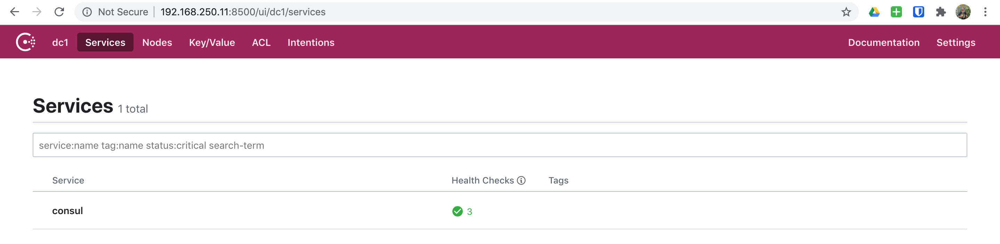
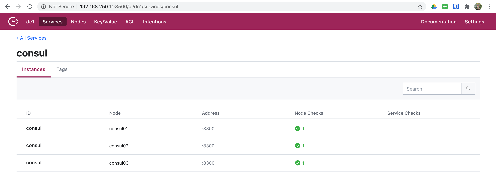

# 06. Consul - Cluster

In this scenario, we will build upon a single Consul server and move onto
setting up a three node Consul cluster.

> NOTE: For most of this setup, we will only cover the differences from our
> single node Consul server. Feel free to jump to [03. Consul](05_Consul.md) to
> go through anything we covered previously.

## Spinning Up

First we need to export our scenario configuration for Vagrant:

```bash
export SCENARIO=scenarios/consul_cluster.yml
```

Now that we've exported our scenario configuration, we are ready to spin up
our environment:

```bash
vagrant up
```

And off we go! You will see a lot going on here as Vagrant and Ansible do their
job.

```bash
▶ vagrant up
Bringing machine 'consul01' up with 'virtualbox' provider...
Bringing machine 'consul02' up with 'virtualbox' provider...
Bringing machine 'consul03' up with 'virtualbox' provider...
...
PLAY RECAP *********************************************************************
consul01                   : ok=30   changed=13   unreachable=0    failed=0    skipped=22   rescued=0    ignored=0
consul02                   : ok=30   changed=13   unreachable=0    failed=0    skipped=21   rescued=0    ignored=0
consul03                   : ok=30   changed=13   unreachable=0    failed=0    skipped=21   rescued=0    ignored=0
```

And once everything completes, we will have a fully functional three node
Consul cluster.

This scenario has the following nodes when completed.

|   Node   |     IP #1      | IP #2 |
| :------: | :------------: | :---: |
| consul01 | 192.168.250.11 |       |
| consul02 | 192.168.250.12 |       |
| consul03 | 192.168.250.13 |       |

## CLI

Now we are ready to begin exploring our Consul cluster using the CLI. So, to do
this. Let's SSH into any one of our nodes `consul0[1-3]`.

```bash
vagrant ssh consul01
```

```bash
▶ vagrant ssh consul01
Welcome to Ubuntu 18.04.4 LTS (GNU/Linux 4.15.0-76-generic x86_64)

 * Documentation:  https://help.ubuntu.com
 * Management:     https://landscape.canonical.com
 * Support:        https://ubuntu.com/advantage

Last login: Mon Jul 20 22:37:48 2020 from 192.168.250.1
vagrant@consul01:~$
```

Now that we've logged in, let's change into the `/etc/consul.d` directory and
see what files/directories are present.

```bash
cd /etc/consul.d
ls -la
```

```bash
vagrant@consul01:~$ cd /etc/consul.d
vagrant@consul01:/etc/consul.d$ ls -la
total 20
drwxr-xr-x  4 root root 4096 Jul 20 22:37 .
drwxr-xr-x 79 root root 4096 Jul 20 22:37 ..
drwxr-xr-x  2 root root 4096 Jul 20 22:37 client
-rw-r--r--  1 root root  898 Jul 20 22:37 config.json
drwxr-xr-x  2 root root 4096 Jul 20 22:37 scripts
vagrant@consul01:/etc/consul.d$
```

### CLI - Configuration

As we can see from above, our files and directories look identical to our single
node Consul server. However, let's take a look at our `config.json` file.

```bash
cat config.json
```

```bash
vagrant@consul01:/etc/consul.d$ cat config.json
{
    "acl": {
        "default_policy": "allow",
        "down_policy": "extend-cache",
        "tokens": {
            "agent": "",
            "agent_master": "",
            "default": "",
            "master": "6DA12E0F-D8A5-48C5-AEFF-00D50E84D01A",
            "replication": ""
        }
    },
    "bind_addr": "192.168.250.11",
    "bootstrap_expect": 3,
    "client_addr": "0.0.0.0",
    "data_dir": "/var/consul",
    "datacenter": "dc1",
    "dns_config": {},
    "enable_acl_replication": false,
    "enable_syslog": true,
    "encrypt": "WWw4l0h1LbB4+pC5+VUWiV8kMBNQc+nEwt8OODMx2xg=",
    "log_level": "DEBUG",
    "node_name": "consul01",
    "performance": {},
    "primary_datacenter": "dc1",
    "retry_join": [
        "192.168.250.11",
        "192.168.250.12",
        "192.168.250.13"
    ],
    "retry_join_wan": [],
    "server": true,
    "telemetry": {},
    "ui": true
}
vagrant@consul01:/etc/consul.d$
```

This configuration looks very much the same as our single node with the
exception of: `bootstrap_expect` and `retry_join`. If you were to compare to
our [single node configuration](05_Consul.md#cli-configuration) you would see
that these two settings are indeed different. How?

### CLI - Nodes

Next, let's get a list of nodes available:

```bash
consul catalog nodes
```

```bash
vagrant@consul01:/etc/consul.d$ consul catalog nodes
Node      ID        Address         DC
consul01  b70ec734  192.168.250.11  dc1
consul02  156f0b03  192.168.250.12  dc1
consul03  6040c3c2  192.168.250.13  dc1
vagrant@consul01:/etc/consul.d$
```

And as we did previously, let's get a more detailed view of our catalog nodes.

```bash
consul catalog nodes --detailed
```

```bash
vagrant@consul01:/etc/consul.d$ consul catalog nodes --detailed
Node      ID                                    Address         DC   TaggedAddresses                                                                           Meta
consul01  b70ec734-8639-0a6b-cc95-8a71b63fb776  192.168.250.11  dc1  lan=192.168.250.11, lan_ipv4=192.168.250.11, wan=192.168.250.11, wan_ipv4=192.168.250.11  consul-network-segment=
consul02  156f0b03-33db-7dfc-bb5b-3c682e51a815  192.168.250.12  dc1  lan=192.168.250.12, lan_ipv4=192.168.250.12, wan=192.168.250.12, wan_ipv4=192.168.250.12  consul-network-segment=
consul03  6040c3c2-b2f8-c17e-ca75-873e83cb6455  192.168.250.13  dc1  lan=192.168.250.13, lan_ipv4=192.168.250.13, wan=192.168.250.13, wan_ipv4=192.168.250.13  consul-network-segment=
vagrant@consul01:/etc/consul.d$
```

Let's also use `curl` to get a detailed view here as well.

```bash
curl --silent http://127.0.0.1:8500/v1/catalog/nodes | jq
```

```bash
vagrant@consul01:/etc/consul.d$ curl --silent http://127.0.0.1:8500/v1/catalog/nodes | jq
[
  {
    "ID": "b70ec734-8639-0a6b-cc95-8a71b63fb776",
    "Node": "consul01",
    "Address": "192.168.250.11",
    "Datacenter": "dc1",
    "TaggedAddresses": {
      "lan": "192.168.250.11",
      "lan_ipv4": "192.168.250.11",
      "wan": "192.168.250.11",
      "wan_ipv4": "192.168.250.11"
    },
    "Meta": {
      "consul-network-segment": ""
    },
    "CreateIndex": 7,
    "ModifyIndex": 9
  },
  {
    "ID": "156f0b03-33db-7dfc-bb5b-3c682e51a815",
    "Node": "consul02",
    "Address": "192.168.250.12",
    "Datacenter": "dc1",
    "TaggedAddresses": {
      "lan": "192.168.250.12",
      "lan_ipv4": "192.168.250.12",
      "wan": "192.168.250.12",
      "wan_ipv4": "192.168.250.12"
    },
    "Meta": {
      "consul-network-segment": ""
    },
    "CreateIndex": 5,
    "ModifyIndex": 8
  },
  {
    "ID": "6040c3c2-b2f8-c17e-ca75-873e83cb6455",
    "Node": "consul03",
    "Address": "192.168.250.13",
    "Datacenter": "dc1",
    "TaggedAddresses": {
      "lan": "192.168.250.13",
      "lan_ipv4": "192.168.250.13",
      "wan": "192.168.250.13",
      "wan_ipv4": "192.168.250.13"
    },
    "Meta": {
      "consul-network-segment": ""
    },
    "CreateIndex": 6,
    "ModifyIndex": 10
  }
]
vagrant@consul01:/etc/consul.d$
```

### CLI - Datacenter Members

To get a list of Consul datacenter members, we can simply execute:

```bash
consul members list
```

```bash
vagrant@consul01:/etc/consul.d$ consul members list
Node      Address              Status  Type    Build  Protocol  DC   Segment
consul01  192.168.250.11:8301  alive   server  1.7.2  2         dc1  <all>
consul02  192.168.250.12:8301  alive   server  1.7.2  2         dc1  <all>
consul03  192.168.250.13:8301  alive   server  1.7.2  2         dc1  <all>
vagrant@consul01:/etc/consul.d$
```

### UI - Services

Click on services and you'll see we only have one service currently in Consul,
which will look like below.



And if you click on the `Consul` service to dig in further, you'll see a bit
of information on our `Consul` service.



### UI - Nodes

Next, let's click on nodes and we **SHOULD** now see our three nodes.


> NOTE: At this point everything else **SHOULD** work the exact same as it did
> with our single node Consul server. And as mentioned previously, feel free to
> explore those different things we did in [03. Consul](05_Consul.md).

## Tearing Down

After you've explored a Consul cluster setup. You'll likely be ready to move
onto more advanced scenarios. So, just as we did when spinning up. We can quickly
tear everything down.

```bash
./scripts/cleanup.sh
```

```bash
▶ ./scripts/cleanup.sh
==> consul03: Forcing shutdown of VM...
==> consul03: Destroying VM and associated drives...
==> consul02: Forcing shutdown of VM...
==> consul02: Destroying VM and associated drives...
==> consul01: Forcing shutdown of VM...
==> consul01: Destroying VM and associated drives...
(venv)
```
