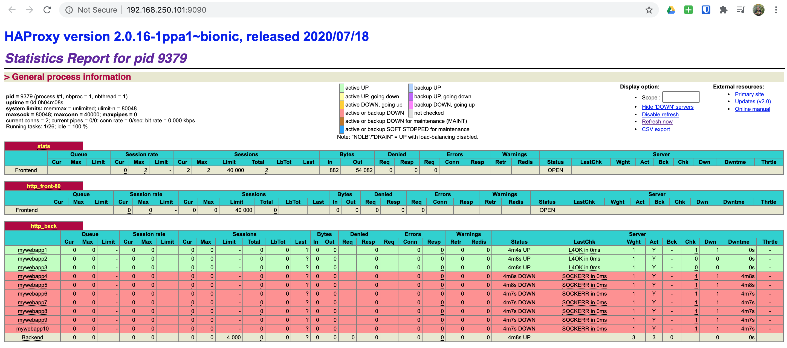

# 07. Consul - Service Discovery with HAProxy

In this scenario, we will be spinning up the following: a single Consul node,
three app servers, and a load balancer.

> NOTE: This scenario was borrowed from [https://learn.hashicorp.com/consul/integrations/haproxy-consul](https://learn.hashicorp.com/consul/integrations/haproxy-consul). However, we've automated the whole process.

## Spinning Up

First we need to export our scenario configuration for Vagrant:

```bash
export SCENARIO=scenarios/consul_service_discovery_haproxy.yml
```

Now that we've exported our scenario configuration, we are ready to spin up
our environment:

```bash
vagrant up
```

And off we go! You will see a lot going on here as Vagrant and Ansible do their
job.

```bash
▶ vagrant up
Bringing machine 'consul01' up with 'virtualbox' provider...
Bringing machine 'app01' up with 'virtualbox' provider...
Bringing machine 'app02' up with 'virtualbox' provider...
Bringing machine 'app03' up with 'virtualbox' provider...
Bringing machine 'lb01' up with 'virtualbox' provider...
...
PLAY RECAP *********************************************************************
app01                      : ok=51   changed=27   unreachable=0    failed=0    skipped=28   rescued=0    ignored=0
app02                      : ok=51   changed=27   unreachable=0    failed=0    skipped=28   rescued=0    ignored=0
app03                      : ok=51   changed=27   unreachable=0    failed=0    skipped=28   rescued=0    ignored=0
consul01                   : ok=38   changed=19   unreachable=0    failed=0    skipped=22   rescued=0    ignored=0
lb01                       : ok=54   changed=30   unreachable=0    failed=0    skipped=10   rescued=0    ignored=0
```

And once everything completes, we will have a fully functional Consul service discovery with HAProxy.

### Nodes

This scenario has the following nodes when completed.

|   Node   |      IP #1      |      IP #2      |
| :------: | :-------------: | :-------------: |
| consul01 | 192.168.250.11  |                 |
|  app01   | 192.168.250.21  |                 |
|  app02   | 192.168.250.22  |                 |
|  app03   | 192.168.250.23  |                 |
|   lb01   | 192.168.250.101 | 192.168.250.201 |

## HAProxy Service Discovery

To get a quick view of the HAProxy admin stats page, head over
[here](http://192.168.250.101:9090/) and login with `admin:admin`.



And as you can see, we have some web servers up, running and fully integrated
with Consul using service discovery.

Let's quickly SSH into our HAProxy server and take a look at the Consul and
HAProxy configurations.

```bash
vagrant ssh lb01
```

```bash
▶ vagrant ssh lb01
Welcome to Ubuntu 18.04.4 LTS (GNU/Linux 4.15.0-76-generic x86_64)

 * Documentation:  https://help.ubuntu.com
 * Management:     https://landscape.canonical.com
 * Support:        https://ubuntu.com/advantage

 * "If you've been waiting for the perfect Kubernetes dev solution for
   macOS, the wait is over. Learn how to install Microk8s on macOS."

   https://www.techrepublic.com/article/how-to-install-microk8s-on-macos/
Last login: Tue Jul 21 20:00:52 2020 from 192.168.250.1
vagrant@lb01:~$
```

Now that we've logged in, let's change to the `/etc/consul.d/client` directory.

```bash
cd /etc/consul.d/client
```

Next let's look at the Consul client configuration.

```bash
cat config.json
```

```bash
vagrant@lb01:/etc/consul.d/client$ cat config.json
{
    "bind_addr": "192.168.250.101",
    "client_addr": "0.0.0.0",
    "data_dir": "/var/consul/data",
    "datacenter": "dc1",
    "enable_script_checks": true,
    "enable_syslog": true,
    "encrypt": "WWw4l0h1LbB4+pC5+VUWiV8kMBNQc+nEwt8OODMx2xg=",
    "log_level": "DEBUG",
    "node_name": "lb01",
    "retry_join": [
        "192.168.250.11"
    ],
    "server": false,
    "ui": true
}
vagrant@lb01:/etc/consul.d/client$
```

And as you can see in the above configuration, we are using Consul as a client
rather than a server (`"server": false`).

Next let's change to the `/etc/haproxy` directory and look at our HAProxy
configuration.

```bash
cd /etc/haproxy
cat haproxy.cfg
```

```bash
vagrant@lb01:/etc/haproxy$ cat haproxy.cfg
#
# Ansible managed
#

global
    log /dev/log local0
    log /dev/log local1 notice
    daemon
    chroot /var/lib/haproxy
    group haproxy
    maxconn 40000
    spread-checks 3
    stats socket /var/run/haproxy.sock mode 660 level admin
    stats timeout 30s
    user haproxy
    # Default SSL material locations
    ca-base /etc/ssl/certs
    crt-base /etc/ssl/private

    # Default ciphers to use on SSL-enabled listening sockets.
    # For more information, see ciphers(1SSL).
    ssl-default-bind-ciphers kEECDH+aRSA+AES:kRSA+AES:+AES256:RC4-SHA:!kEDH:!LOW:!EXP:!MD5:!aNULL:!eNULL
    ssl-default-bind-options no-sslv3

defaults
    log global
    maxconn 40000
    mode tcp
    option dontlognull
    option redispatch
    option tcp-smart-accept
    option tcp-smart-connect
    option tcplog
    retries 3
    timeout client 50000
    timeout connect 50000
    timeout queue 5000
    timeout server 50000

userlist STATSUSERS
    group admin users admin
    user admin insecure-password admin

frontend stats
    acl AuthOkay_ReadOnly http_auth(STATSUSERS)
    acl AuthOkay_Admin http_auth_group(STATSUSERS) admin
    bind *:9090
    mode http
    stats enable
    stats http-request auth realm stats unless AuthOkay_ReadOnly
    stats refresh 10s
    stats show-legends
    stats uri /

frontend http_front-80
    bind 192.168.250.101:80
    default_backend http_back

backend http_back

    balance roundrobin
    server-template mywebapp 10 _web._tcp.service.consul resolvers consul resolve-opts allow-dup-ip resolve-prefer ipv4 check

resolvers consul
  nameserver consul 127.0.0.1:8600
  accepted_payload_size 8192
  hold valid 5s
vagrant@lb01:/etc/haproxy$
```

Now looking at this configuration, the real magic is happening within the
following two blocks:

```bash
backend http_back

    balance roundrobin
    server-template mywebapp 10 _web._tcp.service.consul resolvers consul resolve-opts allow-dup-ip resolve-prefer ipv4 check
```

The above block is defining the `server-template` which is used to perform the
service discovery within our Consul cluster. The template is telling HAProxy
to discover the `web` services that are registered in Consul using the `consul`
resolver as defined below. To do the DNS discovery for us and return the results
back to HAProxy.

```bash
resolvers consul
  nameserver consul 127.0.0.1:8600
  accepted_payload_size 8192
  hold valid 5s
```

## App Servers

We have also spun up three app servers with our stack. These servers will over
time provide us many different services in which we will use for learning. But
for now, the following list is what they provide:

- NGINX: HTTP

> NOTE: SSH to any one of `app[01-03]`.

These servers are also running the Consul client which is configured as below:

```bash
vagrant ssh app01
```

```bash
cd /etc/consul.d/client
cat config.json
```

```bash
vagrant@app01:/etc/consul.d/client$ cat config.json
{
    "bind_addr": "192.168.250.31",
    "client_addr": "0.0.0.0",
    "data_dir": "/var/consul/data",
    "datacenter": "dc1",
    "enable_script_checks": true,
    "enable_syslog": true,
    "encrypt": "WWw4l0h1LbB4+pC5+VUWiV8kMBNQc+nEwt8OODMx2xg=",
    "log_level": "DEBUG",
    "node_name": "app01",
    "retry_join": [
        "192.168.250.11"
    ],
    "server": false,
    "ui": true
}
vagrant@app01:/etc/consul.d/client$
```

And once again, we **SHOULD** notice that our Consul client configuration is
identical to our HAProxy server.

Our Consul services that we are registering, are being done using Ansible. The
following shows how that is accomplished for us. We could also do this creating
Consul client configurations on our app servers, but we've chosen to use Ansible.

`group_vars/app_servers/consul.yml`

```yaml
---
# Define Consul services for app servers
consul_services:
  - name: grafana
    port: 3000
    script: curl --silent http://localhost:3000/api/health
    interval: 3s
    state: present
  - name: web
    port: 80
    script: curl --silent http://localhost
    interval: 3s
    state: present
```

`playbooks/app_servers.yml`

```yaml
- hosts: app_servers
  tasks:
    - name: Manage Consul Services
      consul:
        service_name: "{{ item.name }}"
        service_port: "{{ item.port }}"
        script: "{{ item.script|default(omit) }}"
        interval: "{{ item.interval|default(omit) }}"
        state: "{{ item.state|default(omit) }}"
      become: true
      loop: "{{ consul_services }}"
```

And to prove that they are working correctly through our HAProxy load balancer,
simply browse to [http://192.168.250.101](http://192.168.250.101).


